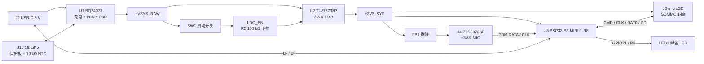
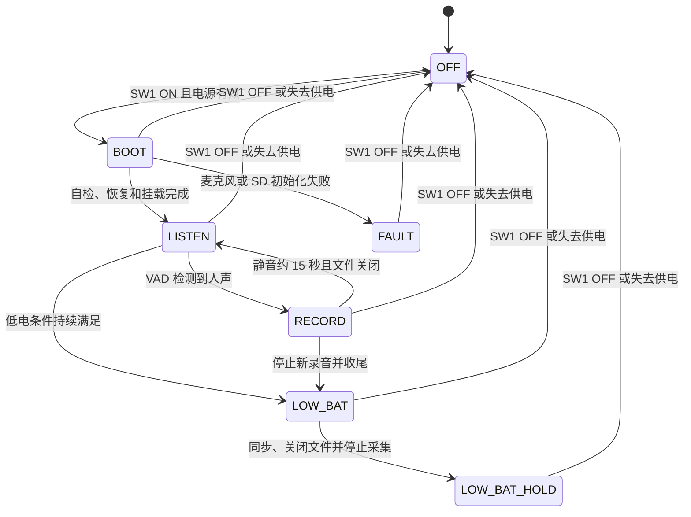

# MC100 V1 硬件设计说明

> 状态：原理图与 PCB 已设计、布线；本次实时 PCB 官方 DRC 通过，0 项违规  
> 制造状态：Gerber 补查发现 U4 焊膏开口覆盖声孔、USB/SD 参考铜跨分割，当前不建议直接投板并 SMT，见 [PCB 复核报告](MC100-PCB-REVIEW.md)  
> 核对日期：2026-09-08  
> 主控：ESP32-S3-MINI-1-N8  
> 产品目标：可长期佩戴，开机持续监听，人声触发本地录音；单次充电工作 24 小时为待实测目标  
> V1 范围：录音、自动语音触发、本地存储、滑动开关开关机与简单状态指示；云端回传不在本版范围

**工程事实以立创 EDA 专业版云工程 `MC100` 的当前原理图和 `PCB1` 为准。** 本说明是设计的同步记录；发生冲突时应先读取 EDA，再修正文档。电路、位号、网络、封装和布局以实时工程为依据，音频参数、VAD、文件恢复和续航要求属于固件/整机目标，不能由原理图或 DRC 通过推定已经实现。

2026-09-08 的[原理图功能与电气复核](MC100-SCHEMATIC-REVIEW.md)记录了关机文件完整性、充电计时、USB 输入浪涌和 LDO 余量的待处理项。麦克风接线未发现明确错误，DATA 电平资料歧义另列为澄清与样机验证项，不作为已确认接线缺陷。五页官方原理图 DRC 均为 0 项，但 P4 因图签字段为空未通过严格检查；本设计尚未获得全部功能和样机可靠性通过结论。

本次逐页读取五页原理图，并与 PCB 的器件身份及焊盘网络对账：56 个放置项一致，234 个对应焊盘记录（含未连接脚及重复地焊盘）未发现网络差异。PCB 官方 DRC 返回 `passed=true`、`total=0`。旧的“未布线”“预布线门禁未通过”“9 项 DRC”记录不再描述当前设计。

同日 10:24 起重新读取五页及 PCB，以上对账结果再次一致；10:34 导出前 UI 原生 DRC 显示 124 项检查、0 个问题。制造文件已确认麦克风 0.60 mm NPTH 存在，但焊膏层声孔避让不正确，且底层 USB/部分 SD 跨 Inner2 分割，见报告 P04/P05。原生 USB、GPIO0 和 EN 下载连接成立，首次烧录和强制恢复的完整步骤见 [MC100-PROGRAMMING.md](MC100-PROGRAMMING.md)。

| 页 | 页面名称 | 放置项数 | 当前功能 |
| --- | --- | ---: | --- |
| P1 | `P1_POWER_PATH` | 17 | USB 输入、BQ24073 充电/Power Path、TLV75733P、主电源去耦、电池座 |
| P2 | `P2_POWER_CONTROL` | 8 | SW1 滑动开关、EN 下拉、LED、电池 ADC 分压及去耦 |
| P3 | `P3_MCU_DEBUG` | 10（含 TP1~TP4） | ESP32-S3-MINI-1-N8、启动/复位网络、4 个测试点 |
| P4 | `P4_USB_AUDIO` | 10 | USB-C、CC 下拉/USB 串阻、ZTS6872SE PDM 麦克风 |
| P5 | `P5_SDMMC_STORAGE` | 11 | microSD 卡座、SD CLK 串阻、总线及卡检测上拉 |

56 项由 **52 个有立创料号的采购器件 + 4 个 PCB 测试点**组成。当前原理图和 PCB 的 TP1~TP4 均仍标记 `addIntoBom=true`，因此不能说“EDA 已排除测试点”；采购/贴装 BOM 需筛除这 4 个无料号测试点。

## 1. 最终方案

MC100 V1 采用 **ESP32-S3 + 单颗 PDM 数字 MEMS 麦克风 + 原生 SDMMC 1-bit microSD** 的全数字录音链路。

ESP32-S3 的 I2S0 直接完成 PDM-to-PCM，SDMMC 主机控制器负责存储卡通信。系统不使用模拟麦克风、外置 ADC、音频 Codec、SDSPI 或 1.8 V 音频电源。

电源采用 1S 锂聚合物电池。BQ24073 负责线性充电和 Power Path；SW1 滑动开关把 `+VSYS_RAW` 接入或断开 `LDO_EN`，R5=100 kΩ 将 EN 下拉。SW1 置 OFF 时关闭 3.3 V 后级系统，BQ24073 与电池仍保持连接，此时插入 USB-C 可以充电而不启动 S3。SW1 保持 ON 时，外部供电恢复可能启动系统。

开机后设备自动进入 `LISTEN`。PDM/I2S 和软件 VAD 持续运行，人声触发后保存 2 秒预录并写入 microSD，连续静音约 15 秒后结束当前录音段。由于设备必须随时听见下一次人声，`LISTEN` 不是 Deep-sleep。

| 子系统 | 当前硬件 / 保留的产品目标 | 设计理由 |
| --- | --- | --- |
| 主控 | ESP32-S3-MINI-1-N8，8 MB Flash，无 PSRAM | I2S0 硬件 PDM-to-PCM、原生 SDMMC、USB 与后续无线能力齐全 |
| 麦克风 | 1 颗 ZTS6872SE PDM MEMS | 单麦满足 V1 录音，不引入双麦同步和结构复杂度 |
| 音频 | 16 kHz、16-bit、mono PCM | 语音记录质量与容量、算力的平衡点 |
| PDM 时钟 | 1.024 MHz，64 倍降采样 | `16 kHz x 64`，匹配 S3 I2S0 与麦克风高性能模式 |
| 自动触发 | 20 ms PCM 帧 VAD，2 秒预录 | 避免漏掉人声起始部分 |
| 存储 | SDMMC 1-bit microSD，首选 32 GB 高耐久卡 | 比 SDSPI 更符合 S3 能力，三根总线信号已远超 32 kB/s 音频需求 |
| SD 供电 | 直接接 `+3V3_SYS` | V1 不增加 SD 负载开关，也不预留负载开关封装 |
| 充电/Power Path | BQ24073RGTR | 支持边充边录，输入能力在系统负载与充电间动态分配 |
| 3.3 V 稳压 | TLV75733PDBVR，1 A LDO | 覆盖 S3 启动与 SD 写入峰值，接受低电池末段进入 dropout |
| 开关机 | HX MINI MSK12CO2 滑动开关 + 100 kΩ EN 下拉 | 机械位置决定系统供电，关机直接关闭 LDO |
| 状态指示 | 1 颗低电流绿色 LED | 正常监听和录音始终熄灭，仅按需短暂反馈 |
| 电池 | 1S 1200 mAh LiPo | 带保护板和 10 kΩ NTC，连续电流不低于 500 mA，脉冲能力不低于 1 A |
| 无线 | 保留 S3 Wi-Fi/BLE 硬件能力 | V1 的 `LISTEN` 和 `RECORD` 中关闭无线 |

设计优先级为：

1. 录音和文件完整性。
2. 24 小时续航。
3. 体积、BOM 成本和后续扩展。

当前没有 ESP32-C3、SDSPI、模拟麦克风、外置 ADC/Codec、双麦、1.8 V 电源、Buck/Boost、WS2812、GEK100、瞬时交互按键、按键隔离二极管、独立 Wake-on-Sound 芯片或 microSD 独立负载开关。

## 2. 系统框图



```text
J2 VBUS -> +VBUS_USB -> BQ24073 IN
J1.1 -> BAT_CONN_POS -> R4 0 ohm -> +VBAT <-> BQ24073 BAT
J1.2 -> $1N267 -> BQ24073 TS
J1.3 -> GND

BQ24073 OUT -> +VSYS_RAW -> TLV75733P IN
+VSYS_RAW -> SW1.1
SW1.2 -> LDO_EN -> TLV75733P EN
LDO_EN -> R5 100 kohm -> GND
SW1.3 -> NC

TLV75733P OUT -> +3V3_SYS -> S3 / microSD / LED
+3V3_SYS -> FB1 -> +3V3_MIC -> PDM MIC
```

开关只控制 LDO EN，不串在系统大电流路径中。OFF 不断开 BQ24073 BAT/OUT；充电路径仍在。当前没有 MCU 到 EN 的控制线，也没有开关位置检测线或独立充电状态检测线。

## 3. 电源、充电与电池

### 3.1 USB-C

- USB-C 作为 USB 2.0 Device/Sink。
- CC1、CC2 分别通过 5.1 kΩ、1% 电阻下拉至 GND。
- VBUS 直接接 BQ24073 IN；当前精简原理图不再保留板载 VBUS TVS。
- 当前精简原理图不再保留 USB D-/D+ 板载 ESD；FB1（GZ2012D601TF）把 `+3V3_SYS` 与 `+3V3_MIC` 隔离。
- D-、D+ 分别接 ESP32-S3 GPIO19、GPIO20。
- D-/D+ 的设计要求为 90 Ω 差分阻抗、短走线和等长；实际板厂叠层/阻抗尚未确认，当前相邻参考铜跨分割需按 PCB 报告 P05 处理。
- R13=5.1 kΩ 下拉 CC1，R11=5.1 kΩ 下拉 CC2；R15=22 Ω 串联 D-，R12=22 Ω 串联 D+。当前没有板载 USB ESD/TVS，整机 ESD 风险仍需实测评估。
- SW1 置 OFF 时 S3 无电，必须验证 D+/D- 和其他外部接口不会向 `+3V3_SYS` 反向供电。
- 保留原生 USB 下载路径，并在 P3 保留 `BOOT_GPIO`、`CHIP_PU` 测试点；UART0 TX/RX 对应 U3.39/40，目前未布线至外部连接器或测试点。

### 3.2 BQ24073

| 项目 | 连接/数值 | 结果 |
| --- | --- | --- |
| `RISET` | 3.00 kΩ，1% | 标称快充约 297 mA，考虑器件误差约 263-328 mA |
| `ILIM` | 3.00 kΩ，1%，不得悬空 | 当前限流由 USB500 档决定；仅在电阻设定模式下约为 517 mA |
| `EN2/EN1` | 0 / 1 | 固定 USB500 模式 |
| `TMR` | 46.4 kΩ，1% | 标称快充安全计时约 6.19 小时；未减速计时的公差范围约 4.59-7.81 小时 |
| `TD` | 低电平 | 启用正常充电终止 |
| `CE` | 低电平 | 默认允许充电，不受 SW1 的系统开关状态控制 |
| `TS` | 电池包 10 kΩ NTC | 不允许固定电阻长期绕过温度保护 |
| `PGOOD# / CHG#` | U1.7 / U1.9 均未连接 | 没有 PGOOD 上拉或 GPIO17 检测，固件不能据此判断 USB/充电状态 |
| `IN` 去耦 | 10 µF + 100 nF | 紧贴 BQ24073 IN |
| `BAT` 去耦 | 10 µF + 100 nF | 紧贴 BQ24073 BAT |
| `OUT` 去耦 | 10 µF + 100 nF | 紧贴 BQ24073 OUT，节点命名 `+VSYS_RAW` |

当前位号：R1=3 kΩ（`BQ_ILIM`）、R3=3 kΩ（`BQ_ISET`）、R2=46.4 kΩ（`BQ_TMR`）；R4=0 Ω 为 `BAT_CONN_POS` 到 `+VBAT` 的电池正极链路。IN 去耦为 C2=10 µF + C10=100 nF，BAT 去耦为 C3=10 µF + C1=100 nF，OUT 去耦为 C6=10 µF + C7=100 nF。

500 mA 是输入给系统和电池充电的总预算，不是两路各 500 mA。开机时 BQ24073 优先维持 OUT，剩余输入能力用于充电，瞬时不足由电池补充；关机时后级无负载，约 300 mA 可用于充电。

TMR 的最短计时须与实际电池充电曲线复核，不能只用标称值比较预计充满时间。DPPM、输入 DPM 和热调节会按电流降低程度放慢计时；细节见复核报告 F03。C2+C10 在 VBUS 前端标称合计 10.1 µF，USB 插入浪涌余量见报告 F04，当前 EDA 电容选值未修改。

1200 mAh 电池以约 300 mA 充电，理想恒流阶段约 4 小时，包含恒压阶段后预计约 5-6 小时。低电量充电时芯片最坏耗散接近 `(5 V - VBAT) x 0.3 A`，必须使用裸露焊盘铺铜和导热过孔，并在密闭外壳、低电池和边录边充时实测温升。

### 3.3 TLV75733P

- IN 接 `+VSYS_RAW`，本地去耦为 C4=10 µF + C5=100 nF。
- OUT 为 `+3V3_SYS`，本地去耦为 C8=22 µF + C9=100 nF。
- EN 接 `LDO_EN`，由 SW1 接到 `+VSYS_RAW`，R5=100 kΩ 下拉；S3 没有控制该节点。
- 系统总有效输出电容控制在 200 µF 以内。
- OUT 到 S3、SD 和麦克风分别做低阻抗分配，避免 SD 瞬态电流经过麦克风回流路径。

TLV75733P 的 300 mV 典型、425 mV 最大压差对应 1 A、结温不高于 85 °C 的测试条件；完整结温范围至 125 °C 时最大值为 475 mV。当前 U2 是 DBV SOT-23-5，无裸露散热焊盘，不能以带散热焊盘的 DYD 参数推定温升。较小负载下压差明显更低，但它仍是 LDO，不会升压。电池接近 3.3 V 后，`+3V3_SYS` 会随电池继续下降。

低电末段应在供电仍可靠时停止录音、同步并关闭文件。当前硬件没有软件断电通道，完成文件收尾不等于关闭 LDO；低电后的待机方式、是否进入低功耗模式及恢复条件需由固件和样机验证确定。

### 3.4 电池要求

用户已确认选定电池为三线、带独立 10 kΩ NTC。以下容量、电流和保护要求仍需用该电池具体规格确认；NTC 曲线及 J1 实物线序尚未归档。

- 1S LiPo，标称 3.7 V，满充 4.2 V。
- 标称容量不低于 1200 mAh。
- 自带过充、过放、过流和短路保护。
- 自带 10 kΩ NTC（已确认）；按实际 B 值/阻温曲线及电池允许充电温度复核 BQ24073 TS 温度窗口。
- 连续放电能力不低于 500 mA。
- 短时脉冲能力不低于 1 A，用于覆盖 S3 启动和 SD 卡写入峰值。
- 电芯、保护板、连接器和走线均需满足上述电流，不得只看裸电芯规格。

## 4. 滑动开关、LED 与电池检测

### 4.1 SW1 系统电源开关

SW1 为 `HX MINI MSK12CO2 / C5149840`，封装 `SW-SMD_MSK12CO2`，单刀双掷侧拨开关。当前连接为：

| 焊盘 / 器件 | 当前网络 | 作用 |
| --- | --- | --- |
| SW1.1 | `+VSYS_RAW` | 有效电源端 |
| SW1.2 | `LDO_EN` | 公共端，接 U2.3 EN |
| SW1.3 | NC | OFF 档不接电源 |
| SW1.4 / SW1.5 | NC | 机械焊盘，PCB 中各有重复焊盘 |
| R5 | `LDO_EN` 到 GND，100 kΩ | OFF 档将 EN 拉低 |
| C12 | `+VSYS_RAW` 到 GND，100 nF | 当前仍保留的常供电域去耦 |

| 条件 | 电气结果 |
| --- | --- |
| SW1 使 1-2 导通 | EN 接到 `+VSYS_RAW`，LDO 启动；供电正常时 S3 开机 |
| SW1 使 2-3 导通 | EN 由 R5 下拉，LDO 关闭 |
| SW1 置 OFF，插入 USB | 充电/Power Path 仍可工作，S3 保持断电 |
| SW1 置 ON，电池或 USB 供电恢复 | LDO 随有效电源恢复，系统可能自动启动 |
| 固件死锁 | SW1 仍可直接关闭 LDO，动作不依赖固件 |

ON/OFF 的左右方向以 PCB 实际旋转和样机通断测试确认，不能仅凭开关型号或原理图符号推定。

**当前没有提前通知 MCU 的关机信号。拨到 OFF 就是硬件掉电，不能保证先执行文件同步。** 旧版 3 秒开机、2 秒软件关机、5 秒强制关机、短按和双击均不适用于当前设计。GPIO10、GPIO15、GPIO17 未接相关控制/检测电路。

低电检测可在电压仍有余量时停止录音并关闭文件，但软件无法拉低 `LDO_EN`。如果产品需要“用户操作后先收尾再断电”，这是后续硬件需求，不能仅靠固件补出当前不存在的检测和保持电路。

### 4.2 状态 LED

```text
U3.25 / GPIO21 -> GPIO7_LED -> R8 3.3 kohm -> LED_ANODE
LED_ANODE -> LED1.1 (A)
LED1.2 (K) -> GND
```

- LED1 为 `A-SP192DGHC-C01-4T / C19171301`，绿色 0603。
- **网络名 `GPIO7_LED` 是现存命名，实际连接 GPIO21；GPIO7 用于 SD CLK。** 固件必须按模组引脚映射配置，不能从网络名推导 GPIO。
- LED 高电平点亮；启动时先将 GPIO21 配置为低电平。
- 保留正常 `LISTEN`/`RECORD` 熄灭、启动/故障/低电可短暂反馈的产品要求；灯语和可视亮度尚需固件/样机验证。
- 目标点亮电流不高于约 0.5 mA，最终按样机实测确认。
- 当前没有短按查询按键。LED 由固件驱动，也没有连接 U1 的充电状态输出。

### 4.3 电池电压检测

```text
+VBAT -> R6 1.0 Mohm -> ADC_BAT -> R7 330 kohm -> GND
                           |
                        C11 100 nF
                           |
                          GND
ADC_BAT -> U3.8 / GPIO4 / ADC1_CH3
```

- R6/R7 为常接分压，未配置 GPIO 控制开关。
- 分压比为 `330 / (1000 + 330) = 0.2481`，4.2 V 电池对应 ADC 约 1.042 V，分压支路约 3.16 µA。
- C11=100 nF 用于采样滤波。采样需考虑输入 RC、ADC 特性、校准和 SD 写入引起的电压波动。
- VBAT 用于低电录音保护和趋势诊断，不直接换算精确电量百分比。
- EVT 用精密电源在 3.2-4.2 V 范围多点标定，并记录负载、电池内阻和温度。
- 低电阈值、持续时间及停止写盘后的行为需结合 LDO dropout、S3 brownout、SD 稳定性和电池保护动作确定，当前不冻结单点阈值。

## 5. ESP32-S3 最小系统

### 5.1 模组与电源

- 模组为 `ESP32-S3-MINI-1-N8`。
- 8 MB 封装内 Flash，无 PSRAM。
- 芯片有 512 KB SRAM；V1 的 2 秒预录缓冲为 64 kB，另配置 32-64 kB 存储缓冲，最终需结合任务栈、DMA 和堆余量验证。
- `+3V3_SYS` 在模组电源入口使用 C14=10 µF + C15=100 nF 去耦。
- CHIP_PU 使用 R10=10 kΩ 上拉、C13=1 µF 对地，接 U3.45 EN 和 TP4。
- GPIO0（U3.4，网络名 `BOOT_GPIO`）使用 R9=10 kΩ 上拉，接下载测试点 TP3。
- UART0 TX/RX（模组 IO43/IO44）不引出测试点，原生 USB 为本版计划的下载/日志通道；应用日志需要固件配置为 USB Serial/JTAG 控制台。
- 原生 USB 使用 GPIO19/20。
- 固件应启用看门狗处理软件失控后的复位；物理断电由 SW1 完成。

### 5.2 启动配置脚

ESP32-S3 的启动配置相关 GPIO 包括 GPIO0、GPIO3、GPIO45 和 GPIO46。V1 不把它们分配给麦克风、SD、按键、LED 或电源控制。

- GPIO0 只保留下载测试点和必要的下载控制；P3 的 `TP3` 即 `BOOT_GPIO`。
- GPIO3、GPIO45、GPIO46 不接会在上电阶段施加不确定电平的外设。
- 在完整原理图和 PCB 定板前，对所有启动默认态、外部上拉/下拉和测试夹具再次复核。

### 5.3 无线策略

- 模组和天线保留 Wi-Fi/BLE 能力。
- V1 的 `LISTEN` 和 `RECORD` 关闭 Wi-Fi 与 BLE。
- 后续加入云端回传时，必须重新评估射频峰值、电池能力、LDO 温升、天线和续航，不能直接沿用本版 24 小时预算。

### 5.4 首次烧录与强制下载

出厂默认 eFuse 下，S3 自带的 ROM 和 USB Serial/JTAG 支持原生 USB 烧录，不需要外置 USB 转串口芯片或预先烧入用户固件。当前硬件已具备所需连接，但仍须在首板验证供电、枚举、写入/校验及正常启动，且先处理 PCB 报告 P05 的 USB 参考层问题。

使用数据 USB 线、SW1 置 ON。先把 TP3（GPIO0）接 TP1（GND），再把 TP4（EN）短暂接地后释放；保持 TP3 接地约 1 秒后释放，即可选择 ROM 下载。烧录完成、TP3 已释放后再次复位，恢复正常 Flash 启动。TP2 是 3V3 电源测量点，禁止短接到地。本板没有 BOOT/RESET 按钮，操作用探针、夹具或临时线。

GPIO46 在本板未连接外设，芯片默认弱下拉满足联合下载条件。步骤、测试点实际尺寸、USB 日志与 UART 的区别以及原厂依据见 [首次烧录与强制下载](MC100-PROGRAMMING.md)。SMT 完成不等于已具有录音功能，仍需要适配 MC100 的固件。

## 6. PDM 麦克风与音频链路

### 6.1 链路

ZTS6872SE 内部已经把声压转换为 PDM 数字比特流。ESP32-S3 I2S0 支持硬件 PDM-to-PCM RX：

```text
声音
  -> ZTS6872SE
  -> PDM DATA
  -> ESP32-S3 I2S0 PDM RX
  -> 16 kHz / 16-bit / mono PCM
  -> VAD + 2 秒环形预录
  -> 有界存储队列
  -> SDMMC 1-bit microSD
```

因此不需要外置 ADC 或 ES8311 一类 Codec，也不需要喇叭通道和 1.8 V 音频电源。

### 6.2 电气连接

| 麦克风信号 | 连接 | 要求 |
| --- | --- | --- |
| VDD | `+3V3_MIC` | 经 FB1 从 `+3V3_SYS` 隔离，C16=1 µF + C17=100 nF |
| GND | 完整地平面 | 不破坏声孔周围回流 |
| CLK | GPIO2 | 目标 1.024 MHz；R14=22 Ω，连接 `PDM_CLK_MCU` 与 `PDM_CLK_MIC` |
| DATA | GPIO1 | 短走线，远离 SD_CLK、USB 和开关噪声 |
| SELECT | GND | 固定单声道槽位，固件用实测确认有效声道 |

**当前接线未发现明确错误，保留用于样机验证。** ZTS6872SE DS-1.6 将输入/输出门限合写为 0.65/0.35×VDD（Iout=1 mA），S3 输入要求为 0.75/0.25×VDD。该表不能直接证明实际高阻负载下输出不兼容，也未提供完整的输出裕量保证；详见复核报告 F02 的资料澄清与波形验证要求，目前不据此要求增加电平转换或更换麦克风。SELECT 接地时麦克风在下降沿后驱动数据、上升沿后进入高阻；需确认采样沿/槽位，并预留最大 25 ms 启动稳定时间。

```text
PDM CLK = 16,000 sample/s x 64 = 1.024 MHz
```

ESP32-S3 的 64 倍 PDM 下采样由 I2S0 硬件完成。1.024 MHz 位于 ZTS6872SE 的 1-4.8 MHz 高性能模式范围，因此 `LISTEN` 和 `RECORD` 都按麦克风 800 µA 典型、1 mA 最大做预算，不能引用 350-800 kHz 低功耗模式的 300 µA 数字。

### 6.3 帧、缓冲和队列

- PCM 帧长为 20 ms。
- 每帧大小为 `16,000 x 0.02 x 2 = 640 byte`。
- 2 秒预录包含 100 帧，共 64,000 byte。
- `LISTEN` 环形缓冲满时覆盖最旧帧，永远保留最近 2 秒。
- I2S/PDM 只由 Audio Task 操作，ISR/DMA 回调只发布有界事件。
- VAD 触发后冻结一个预录快照，再按序追加实时帧，必须避免触发边界重复、乱序或空洞。
- Audio Task 不得被 SD 写入阻塞。
- Audio 到 Storage 的缓冲为 32-64 kB 有界队列；正常量产卡的 EVT 验收要求零丢帧。
- 如果异常长 SD 延迟导致队列溢出，固件必须计数并在文件元数据中标记缺口，不能静默生成看似连续的文件。
- 连续静音约 15 秒后结束当前语音段。
- 单段持续 5 分钟时轮换新文件，避免无限增长。

### 6.4 声学结构

- ZTS6872SE 为底部进音，PCB 必须设置与器件声孔对齐的非金属化通孔。
- 声孔、钢网、防水透声膜和外壳开孔间使用闭孔泡棉或硅胶密封，避免侧漏。
- 声孔中心及禁锡区域不得开钢网，外围接地环按原厂建议分段开口；回流、清洗和点胶不得堵孔。当前导出 GTP 在该处仍是实心圆开口，必须处理，见 PCB 报告 P04；不能把本条要求当成已落实的现状。
- 麦克风放在板中心上部、靠近上侧结构开孔，远离 microSD 卡座、USB、充电器、LDO 和天线。
- SD_CLK 禁止从麦克风或声孔下方穿过。
- EVT 比较裸板、装壳和佩戴三种状态的底噪、风噪、衣物摩擦噪声与语音清晰度。

## 7. microSD 与 SDMMC 1-bit

### 7.1 为什么使用 SDMMC

ESP32-S3 集成 SD/MMC 主机控制器，支持 1-bit、4-bit 和 8-bit 总线。MC100 只需写入 32 kB/s 的单声道 PCM，因此 1-bit 已有极大带宽余量，同时比 4-bit 少占三根 GPIO。

V1 使用原生 SDMMC，不使用 SDSPI：

```text
ESP32-S3 GPIO8 -> SD CMD
ESP32-S3 GPIO7 -> SD CLK
ESP32-S3 GPIO6 <- SD DAT0
```

CMD 实际为双向命令线，DAT0 为双向数据线；上表箭头只表示主要数据方向，原理图网络应按双向信号处理。

### 7.2 当前电气连接

J3 为 `TF PUSH / C393941`，VDD 直接接 `+3V3_SYS`，没有独立负载开关。去耦为 C20=100 nF、C19=10 µF、C18=47 µF。

| J3 引脚 | 网络 | S3 连接 / 外围 |
| --- | --- | --- |
| 1 DAT2 | `SD_DAT2_CARD` | R21=10 kΩ 上拉，不接 MCU |
| 2 CD/DAT3 | `SD_DAT3_CARD` | R17=10 kΩ 上拉，不接 MCU |
| 3 CMD | `SDMMC_CMD` | 直连 GPIO8，R16=10 kΩ 上拉 |
| 4 VDD | `+3V3_SYS` | 系统 3.3 V |
| 5 CLK（库符号名 CLX） | `SD_CLK_CARD` | 经 R22=22 Ω 接 `SDMMC_CLK_MCU` / GPIO7 |
| 6 VSS | `GND` | 地 |
| 7 DAT0 | `SDMMC_DAT0` | 直连 GPIO6，R18=10 kΩ 上拉 |
| 8 DAT1 | `SD_DAT1_CARD` | R19=10 kΩ 上拉，不接 MCU |
| CD 机械检测 | `SD_CARD_DETECT` | GPIO5，R20=10 kΩ 上拉 |
| 10 / 11 / 12 / 13 | `GND` | 卡座接地焊盘 |

- **CMD 和 DAT0 当前没有串联电阻，也没有预留的 0 Ω 串阻位。** R16/R18 是上拉电阻。
- 1-bit 模式只使用 CMD、CLK、DAT0；DAT1-DAT3 保留外部上拉。
- 机械 CD 与引脚 2 的 CD/DAT3 不同，插卡检测有效电平需用实际卡座验证。
- CLK 不上拉，R22 是当前唯一 SD 信号串阻；没有板载 microSD ESD 阵列。
- 保留固件初始 20 MHz、EVT 再评估 40 MHz 的目标，V1 不使用 80 MHz。
- 卡在 `LISTEN` 中保持供电但不写入，在 `RECORD` 中批量写入，空闲电流必须计入续航。
- 实际卡座/外壳需验证 ESD、插拔、供电瞬态和信号完整性。

### 7.3 卡与容量

- 首选 32 GB 高耐久 microSD。
- 量产前至少测试 3 个具体卡型号。
- 测试项目包括空闲电流、平均写入电流、峰值电流、最长写延迟、异常掉电恢复和寿命。
- 卡不能在录音中由用户随意拔出；若结构允许热插拔，必须实现 Card Detect 和明确的错误恢复。

| 项目 | 数值 |
| --- | ---: |
| PCM 数据率 | 32,000 byte/s |
| 每小时 | 115.2 MB |
| 24 小时 | 2.7648 GB |
| 16 GB 理论连续录音 | 约 5.8 天 |
| 32 GB 理论连续录音 | 约 11.6 天 |

实际可用时间需扣除格式化容量差异、文件系统、恢复元数据和保留空间。VAD 会降低典型写入量，但供电和容量仍按全天连续录音做压力设计。

### 7.4 文件与异常掉电

SW1 拨到 OFF 就可能在任意一次 SD 写入中断电，MCU 没有提前通知和电源保持通道。掉电恢复是日常关机路径的一部分；低电检测可以提前收尾，但不能覆盖用户直接拨动开关。以下为固件与卡型验证要求，尚不能视为已经通过的文件完整性保证。

1. 录音使用临时扩展名，完成同步和关闭后再重命名；重命名本身也必须接受掉电测试，不能假设 FAT 元数据更新天然抗断电。
2. 长文件预分配固定上限，录音期间尽量顺序写已分配区域。
3. 音频使用带序号、有效长度和 CRC 的固定块。
4. 上电扫描最后一个有效块并恢复上一份临时文件。
5. 恢复失败时保留原文件并报告，不得静默删除。
6. 按经过功耗、磨损和掉电测试确定的周期同步必要元数据。
7. WAV 头只在正常关闭或启动恢复时最终生成/修正。
8. 剩余空间低于 10% 时停止新录音并进入可诊断状态。

Storage Task 独占 SDMMC/FATFS。其他任务只通过有界消息和缓冲请求写入，不直接调用文件系统。

## 8. 当前 GPIO 与模组焊盘映射

下表同时列出 GPIO、U3 模组焊盘号和真实网络，避免将网络名误当成 GPIO 编号。U3 为 ESP32-S3-MINI-1-N8；模组规格书 v1.7 物理 PDF 第 10-11 页表 3-1 已与原图复核。

| 功能 | GPIO | U3 焊盘 | 当前网络 / 端点 |
| --- | ---: | ---: | --- |
| PDM DATA | 1 | 5 | `PDM_DATA` -> U4.1 |
| PDM CLK | 2 | 6 | `PDM_CLK_MCU` -> R14=22 Ω -> U4.4 |
| 电池 ADC | 4 | 8 | `ADC_BAT`，R6/R7/C11，ADC1_CH3 |
| SD 卡检测 | 5 | 9 | `SD_CARD_DETECT` -> J3.CD，R20 上拉 |
| SDMMC DAT0 | 6 | 10 | `SDMMC_DAT0` -> J3.7，R18 上拉 |
| SDMMC CLK | 7 | 11 | `SDMMC_CLK_MCU` -> R22=22 Ω -> J3.5 |
| SDMMC CMD | 8 | 12 | `SDMMC_CMD` -> J3.3，R16 上拉 |
| USB D- | 19 | 23 | `USB_DM_MCU` -> R15=22 Ω -> `USB_N` |
| USB D+ | 20 | 24 | `USB_DP_MCU` -> R12=22 Ω -> `USB_P` |
| 状态 LED | 21 | 25 | `GPIO7_LED` -> R8=3.3 kΩ -> LED1 |
| 下载 BOOT | 0 | 4 | `BOOT_GPIO` -> TP3，R9 上拉 |
| 复位 EN | 非 GPIO | 45 | `CHIP_PU` -> TP4，R10/C13 |
| UART0 TX | 43 | 39 | 当前未连接，无测试点 |
| UART0 RX | 44 | 40 | 当前未连接，无测试点 |

- GPIO10（U3.14）、GPIO15（U3.19）、GPIO17（U3.21）均未连接，分别不再承担 GEK RST、按键检测、PGOOD 检测。
- `GPIO7_LED` 实际属于 GPIO21；GPIO7 是 SD CLK。该名称保留 EDA 原状。
- GPIO3、GPIO9、GPIO11~GPIO14、GPIO16、GPIO18、GPIO45、GPIO46 以及其余未使用模组 IO 当前没有外接功能。不要把“未连接”推定为可以绕过模组约束任意使用。
- EVT 仍需核对启动配置脚默认电平、下载夹具以及上电/复位/OFF 时的外部接口电平。

## 9. 运行状态与固件边界

### 9.1 与当前硬件相符的状态边界

以下为固件行为目标，当前目录没有可用于确认实现状态的 MC100 固件。原理图只能确定电源和接口连接。



| 状态 | PDM/I2S / VAD | microSD | 系统电源 |
| --- | --- | --- | --- |
| `OFF` | 断电 | 断电 | SW1 OFF，或外部供电消失 |
| `BOOT` | 初始化 | 挂载、恢复临时文件 | 开启 |
| `LISTEN` | 持续采集和检测 | 有电，正常不写入 | 开启 |
| `RECORD` | 持续采集和检测 | 批量写入 | 开启 |
| `LOW_BAT` | 停止新会话并停止采集 | 在电压仍可靠时收尾 | 开启，供电余量有限 |
| `LOW_BAT_HOLD` | 停止 | 停止写入/卸载 | **LDO 仍开着**，低功耗与恢复策略待验证 |
| `FAULT` | 按故障类型停止 | 保留可诊断信息 | 由 SW1 决定 |

`LOW_BAT_HOLD` 表示软件已停止录音，不能标成物理 OFF；也不能承诺无限等待而不继续消耗电池。固件需验证低功耗状态、复位后低电判断和供电恢复策略，防止低电反复启动写卡。

SW1 OFF 可以跳过任何软件收尾阶段。原先“按住 2 秒 -> SHUTDOWN -> GPIO10 断电”的状态转换已删除。正常监听/录音仍要求无线关闭、LED 熄灭。

### 9.2 任务所有权

- Main/State Task 是设备级状态的唯一写入者。
- Audio Task 独占 I2S0、PDM RX、VAD 和预录环形缓冲。
- Storage Task 独占 SDMMC、FATFS 和录音文件。
- 电池 ADC、SD 卡检测只发布状态事件，不直接关闭驱动或操作文件。
- 当前不配置 Button ISR、GEK RST 输出或 BQ PGOOD 输入任务。
- 跨任务队列须有固定容量、满策略、超时/丢弃计数和停止时的唤醒方式。
- 开始/停止录音使用递增 generation，拒绝旧会话的迟到帧和完成通知。
- SD 写入不能持有音频驱动锁，也不能阻塞 I2S DMA 消费。

### 9.3 监听功耗策略

- `LISTEN` 中 PDM 麦克风、PDM CLK、I2S RX 和 VAD 持续运行。
- 不使用会停止上述链路的 Deep-sleep。
- 首版以 40 MHz CPU 时钟作为监听基线验证，一核承担音频/VAD，另一核尽量阻塞于 WAITI。
- DMA 帧之间阻塞等待，禁止忙轮询。
- 关闭 Wi-Fi/BLE 和未使用外设时钟。
- 如果 40 MHz 不能稳定满足 I2S、VAD、文件切换和系统服务，再按测量结果提升到 80 MHz。
- microSD 在监听态保持供电但不写入。

## 10. 续航与电流预算

1200 mAh 电池按 80% 可用容量估算：

```text
1200 mAh x 80% / 24 h = 40 mA
```

40 mA 是没有工程余量的理论上限。MC100 V1 的整机电池侧平均电流设计目标为 **不高于 35 mA**，为电芯差异、温度、老化、LDO 损耗和 SD 卡差异留出余量。

ESP32-S3 芯片数据手册 v2.2 在 Modem-sleep、外设时钟开启条件下给出的典型值：

| CPU 状态 | 40 MHz | 80 MHz |
| --- | ---: | ---: |
| 双核 WAITI | 18.8 mA | 36.1 mA |
| 单核执行 32-bit 数据访问，另一核空闲 | 21.8 mA | 42.6 mA |

这些是芯片在指定测试条件下的典型数据，不等于 MC100 整机电流，也不能替代实测。实际值还包括 Flash 访问、PDM/I2S、VAD、SD、麦克风、LDO 和任务调度。

| 负载 | V1 处理 |
| --- | --- |
| ESP32-S3 | 40 MHz 监听基线，一核工作、另一核尽量 WAITI；无线关闭 |
| ZTS6872SE | 监听和录音均按 0.8 mA typ / 1 mA max |
| microSD | 监听时空闲，录音时 32-64 kB 批量写；多卡实测 |
| TLV75733P | 25 µA 典型静态电流 |
| SW1 / R5 | 开关只驱动 EN；ON 时 100 kΩ 下拉消耗约 `VSYS_RAW / 100 kΩ`，3.3-4.4 V 时约 33-44 µA |
| LED | 常态熄灭，瞬时反馈目标小于约 0.5 mA |
| VBAT 分压 | 常接分压，约 3.2 µA 静态支路电流 |

若 24 小时场景平均电流超过 35 mA，按以下顺序处理：

1. 消除 CPU 忙等，测量任务运行时间和 WAITI 占比。
2. 优化 VAD 算法和 DMA 帧尺寸。
3. 增大合理的批量写入，减少 SD 唤醒和 FAT 元数据更新。
4. 更换空闲和写入电流更低、最长延迟更可控的高耐久卡。
5. 重新评估 1200 mAh 电池余量或下一版硬件 Wake-on-Sound。

不能通过提高 VAD 阈值造成漏录来换取纸面续航，也不在 V1 文档里承诺未实测的 24 小时结果。

## 11. 当前 PCB 与结构

### 11.1 实时 PCB 状态（2026-09-08）

| 项目 | 当前读取结果 |
| --- | --- |
| PCB | MC100 / `PCB1`，文档 UUID `588d07309976e518` |
| 放置项 | 56，Top 52 / Bottom 4；Bottom 为 TP1~TP4 |
| 板框 | 单个连续多边形，中心线外廓约 50 mm x 30 mm，右上为与外边相通的天线缺口 |
| 铜层 | 4 层：Top SIGNAL / Inner1 PLANE / Inner2 SIGNAL / Bottom SIGNAL |
| 铜走线 | 268 个直线段（Top 236、Bottom 32）及 7 个圆弧 |
| 普通过孔 | 80 个（此数为 via-list 的独立过孔，不含封装内焊盘/孔），孔径/外径均为 12/24 mil |
| 可枚举铺铜 | 6 区，包含顶底 GND、Inner2 的电源分区及 GND；另有顶层静态填充铜 5 区 |
| 官方 PCB DRC | `passed=true`，`total=0` |
| 原理图/PCB 对账 | 56 个器件身份和 234 个对应焊盘记录匹配，未发现网络差异 |

板框折线坐标范围 x=0~1968.5、y=0~1181.1 mil，对应约 50 x 30 mm。工具返回的几何 bbox 另含线宽外扩，不能拿其 1978.5 x 1191.1 mil 直接当成板尺寸。

原理图与 PCB 已有完整设计，旧的二维飞线交叉数、预布线工作流状态和未布线记录不再作为当前进度。**本次 DRC 通过是当前设计规则检查结果，不替代板厂 DFM、阻抗确认、贴装装配或样机验证。** 本次文档同步没有改动 EDA 器件、网络、走线或铺铜。

本节数量已按同日后续 PCB 检查更新，10:24 后重新读取的走线仍为 268 个直线段、7 个圆弧和 80 个独立过孔。10:34 的制造文件已确认声孔 NPTH，同时发现 U4 焊膏覆盖声孔及 Bottom 信号跨 Inner2 分割。R22 源端阻尼位置、C20 卡座就近去耦和六处可见位号告警仍待处理；板厂阻抗叠层及工厂最终钢网未确认，详见 [PCB 复核报告](MC100-PCB-REVIEW.md)。

### 11.2 结构位置

下表为实时器件 bbox 几何中心，单位 mil，EasyEDA y-up；不是器件原点，也不是机械加工尺寸。

| 器件 | 层 | 中心 (x, y) | 功能 / 位置 |
| --- | --- | --- | --- |
| J1 | Top | (1110.0, 202.9) | 底部长边电池座，HDGC2001WR-S-3P |
| J2 | Top | (164.8, 220.0) | 左短边 USB-C |
| J3 | Top | (313.6, 834.0) | 左短边 microSD |
| SW1 | Top | (1905.2, 200.0) | 右短边侧拨滑动开关，旋转 90° |
| LED1 | Top | (1740.0, 76.1) | 状态 LED，旋转 -90° |
| U1 | Top | (720.0, 273.2) | BQ24073 |
| U2 | Top | (1472.5, 230.6) | TLV75733P |
| U3 | Top | (1644.3, 755.4) | 右上 ESP32-S3 模组 |
| U4 | Top | (1020.0, 1083.5) | 中上部底部进音麦克风 |

- U3 天线禁布区为 Multi-Layer，约 x=1322.465~1968.865、y=962.869~1184.269 mil，包含 `no-fills/no-wires/no-pours/no-inner-electrical`。
- 板框右上缺口沿 x=1322.465、y=962.869 mil 与外边相接，不是内部孤立槽。
- 6 个可枚举铺铜区中 Top/Bottom 各 1 个 GND；Inner2 共 4 区，分别为 `+3V3_SYS`、`+VBUS_USB`、`+VSYS_RAW` 和 GND。
- 顶层另有 `+VBAT`、`+VBUS_USB`、`+VSYS_RAW`、`+3V3_SYS`、`+3V3_MIC` 五个静态填充铜区，不能与铺铜区数量混算或遗漏。
- Inner2 的 GND 区仍名为 `L1_GND_FULL1`，其实际层为 Inner2，不能按名称推断层号。
- Inner1 的 PLANE 网络绑定未由本次铺铜列表直接暴露，不能将“列表未显示”写成“尚未铺地”或据此重复创建平面。
- J1 当前中心与旧文档的 (1100, 197.9) 不同，结构配合应引用当前 PCB；电池插头极性和锁扣方向仍需实物确认。
- 外壳需对应 USB/卡座口、SW1 行程、LED 导光和麦克风声道；天线附近电池/金属净空仍需装机验证。

### 11.3 测试点与量测位置

| 位号 | 层 | 网络 | 用途 |
| --- | --- | --- | --- |
| TP1 | Bottom | `GND` | 调试/量测公共参考 |
| TP2 | Bottom | `+3V3_SYS` | 系统电源 |
| TP3 | Bottom | `BOOT_GPIO` | 强制下载模式 |
| TP4 | Bottom | `CHIP_PU` | 复位与救板 |

- 四个测试点实际铜直径均为 0.762 mm，当前制造阻焊开窗直径均为 0.8636 mm；底层无焊膏开口。具体坐标及 BOOT/EN 操作见 [烧录说明](MC100-PROGRAMMING.md)。
- UART0 TX/RX 未引出测试点，下载使用原生 USB，应用日志需另行配置 USB Serial/JTAG 控制台。
- VBUS 从 J2 或 C2/C10 测量；VBAT 从 J1/R4/C3 测量；VSYS_RAW 从 U1 OUT、U2 IN 或其去耦焊盘测量。
- NTC 从 J1.2/U1.1 测量；ADC_BAT 从 R6/R7/C11 测量；LDO_EN 从 SW1.2/R5/U2.3 测量。
- 电池电流串测可利用 R4 0 Ω 链路，由夹具实施，不短接电池。
- USB、PDM、SD 信号从实际串阻或端点焊盘测量；CMD/DAT0 没有串阻位，直接使用 J3/U3 端点。
- 当前不存在 KEY_RAW、POWER_KEY_SENSE、GEK_RST、GEK_OUTH 或 BQ_PGOOD 的专用检测电路。

## 12. 当前 BOM 与阻容对照

以下依据 2026-09-08 实时器件属性整理，共 52 个有采购料号的器件、25 种不同料号。同日已逐料号查询嘉立创国内 SMT 器件库，经济型/标准型支持标记见 12.4；库存和价格会变化，以实际下单时为准，批次与替代料尚未核对。

### 12.1 主器件

| 位号 | 功能 | 型号 | 立创编号 | 当前说明 |
| --- | --- | --- | --- | --- |
| U1 | 充电/Power Path | BQ24073RGTR | C15220 | QFN-16，PGOOD#/CHG# 未连接 |
| U2 | 3.3 V LDO | TLV75733PDBVR | C485517 | SOT-23-5，EN 由 SW1 控制 |
| U3 | MCU 模组 | ESP32-S3-MINI-1-N8 | C2913206 | 8 MB Flash，无 PSRAM |
| U4 | PDM 麦克风 | ZTS6872SE | C42372687 | 单颗，底部进音 |
| SW1 | 滑动电源开关 | HX MINI MSK12CO2 | C5149840 | SW-SMD_MSK12CO2，只控制 EN |
| LED1 | 绿色 LED | A-SP192DGHC-C01-4T | C19171301 | LED0603-FD，1=A、2=K |
| J1 | 电池座 | HDGC2001WR-S-3P | C2936225 | 1=BAT_CONN_POS、2=NTC、3=GND；4/5 NC |
| J2 | USB-C | TYPE-C-31-M-12 | C165948 | USB 2.0 Device/Sink |
| J3 | microSD 卡座 | TF PUSH | C393941 | 带独立机械 CD |
| FB1 | 麦克风电源磁珠 | GZ2012D601TF | C1017 | L0805，连接 +3V3_SYS 与 +3V3_MIC |

电池包已由用户选定，已确认三线和 10 kΩ NTC；具体型号及容量/保护参数尚待归档，原要求为 1S 1200 mAh、带保护板。电池包不计入上述 PCB 52 个采购器件。

### 12.2 全部电阻

| 位号 | 当前值 | 封装 | 立创编号 | 作用 |
| --- | --- | --- | --- | --- |
| R1 | 3kΩ | R0402 | C25784 | BQ_ILIM 对地 |
| R2 | 46.4kΩ | R0402 | C52378 | BQ_TMR 对地 |
| R3 | 3kΩ | R0402 | C25784 | BQ_ISET 对地 |
| R4 | 0Ω | R0603 | C2906974 | 电池正极链路 |
| R5 | 100kΩ | R0402 | C25741 | LDO_EN 下拉 |
| R6 | 1MΩ | R0402 | C26083 | VBAT 分压上臂 |
| R7 | 330kΩ | R0402 | C25778 | ADC_BAT 分压下臂 |
| R8 | 3.3kΩ | R0402 | C25890 | LED 限流 |
| R9 | 10kΩ | R0402 | C25744 | BOOT_GPIO 上拉 |
| R10 | 10kΩ | R0402 | C25744 | CHIP_PU 上拉 |
| R11 | 5.1kΩ | R0402 | C25905 | CC2 下拉 |
| R12 | 22Ω | R0402 | C25092 | USB D+ 串阻 |
| R13 | 5.1kΩ | R0402 | C25905 | CC1 下拉 |
| R14 | 22Ω | R0402 | C25092 | PDM CLK 串阻 |
| R15 | 22Ω | R0402 | C25092 | USB D- 串阻 |
| R16 | 10kΩ | R0402 | C25744 | SD CMD 上拉 |
| R17 | 10kΩ | R0402 | C25744 | SD DAT3 上拉 |
| R18 | 10kΩ | R0402 | C25744 | SD DAT0 上拉 |
| R19 | 10kΩ | R0402 | C25744 | SD DAT1 上拉 |
| R20 | 10kΩ | R0402 | C25744 | SD 机械 CD 上拉 |
| R21 | 10kΩ | R0402 | C25744 | SD DAT2 上拉 |
| R22 | 22Ω | R0402 | C25092 | SD CLK 串阻 |

### 12.3 全部电容

| 位号 | 当前值 | 封装 | 立创编号 | 电路位置 |
| --- | --- | --- | --- | --- |
| C1 | 100 nF | 0402 | C1525 | BQ BAT |
| C2 | 10 µF | 0603 | C19702 | BQ IN |
| C3 | 10 µF | 0603 | C19702 | BQ BAT |
| C4 | 10 µF | 0603 | C19702 | LDO IN |
| C5 | 100 nF | 0402 | C1525 | LDO IN |
| C6 | 10 µF | 0603 | C19702 | BQ OUT |
| C7 | 100 nF | 0402 | C1525 | BQ OUT |
| C8 | 22 µF | 0805 | C45783 | LDO OUT |
| C9 | 100 nF | 0402 | C1525 | LDO OUT |
| C10 | 100 nF | 0402 | C1525 | BQ IN |
| C11 | 100 nF | 0402 | C1525 | ADC_BAT 滤波 |
| C12 | 100 nF | 0402 | C1525 | +VSYS_RAW 去耦 |
| C13 | 1 µF | 0402 | C52923 | CHIP_PU RC |
| C14 | 10 µF | 0603 | C19702 | MCU 供电 |
| C15 | 100 nF | 0402 | C1525 | MCU 供电 |
| C16 | 1 µF | 0402 | C52923 | 麦克风供电 |
| C17 | 100 nF | 0402 | C1525 | 麦克风供电 |
| C18 | 47 µF | 0805 | C16780 | microSD 供电 |
| C19 | 10 µF | 0603 | C19702 | microSD 供电 |
| C20 | 100 nF | 0402 | C1525 | microSD 供电 |

采购按精确料号核对耐压、精度和温度等级。当前部分实例的耐压/精度/说明属性仍为空，不能将其描述为“所有属性已标准化完成”。阻容 `Value` 已可读取，以上数值来自当前实例。

TP1~TP4 是测试焊盘，没有采购料号；虽然 EDA 的 `addIntoBom` 仍为 true，采购/贴装表应过滤。当前没有 GEK100、TS24CA、BAS116、板载 USB/SD ESD、VBUS TVS、Codec、1.8 V LDO 或 SD 负载开关。

### 12.4 嘉立创 SMT 经济型/标准型核对（2026-09-08）

**当前 BOM 中，U3 / C2913206 和 U4 / C42372687 被国内官方器件库明确标记为“标准型SMT专用”。因此，保持这两个料号并交由嘉立创整板全贴，应选标准型。** 其余 23 种料号、50 颗元件均在官方可贴库中，查询时未显示标准型专用限制。

本表按实际料号匹配，不按“ESP32”“麦克风”“QFN”“LGA”等类别猜测。“未见标准型限制”只记录查询时没有显示“标准型SMT专用”标记，不能反推经济型一定可贴。是否能使用经济型仍需通过实际订单的 BOM 匹配、库存和 PCB 工艺条件检查；本次没有提交或验证本板的经济型订单。

| 位号 | 立创料号及官方入口 | 贴装档位 | 当前库分类 |
| --- | --- | --- | --- |
| U3 | [C2913206](https://www.jlc-smt.com/lcsc/detail/C2913206.html) | 标准型专用 | 扩展库 |
| U4 | [C42372687](https://www.jlc-smt.com/lcsc/detail/C42372687.html) | 标准型专用 | 扩展库 |
| U1 | [C15220](https://www.jlc-smt.com/lcsc/detail/C15220.html) | 未见标准型限制 | 扩展库 |
| U2 | [C485517](https://www.jlc-smt.com/lcsc/detail/C485517.html) | 未见标准型限制 | 扩展库 |
| J1 | [C2936225](https://www.jlc-smt.com/lcsc/detail/C2936225.html) | 未见标准型限制 | 扩展库 |
| J2 | [C165948](https://www.jlc-smt.com/lcsc/detail/C165948.html) | 未见标准型限制 | 扩展库 |
| J3 | [C393941](https://www.jlc-smt.com/lcsc/detail/C393941.html) | 未见标准型限制 | 扩展库 |
| SW1 | [C5149840](https://www.jlc-smt.com/lcsc/detail/C5149840.html) | 未见标准型限制 | 扩展库 |
| LED1 | [C19171301](https://www.jlc-smt.com/lcsc/detail/C19171301.html) | 未见标准型限制 | 扩展库 |
| FB1 | [C1017](https://www.jlc-smt.com/lcsc/detail/C1017.html) | 未见标准型限制 | 基础库，标记免换料费 |
| R1、R3 | [C25784](https://www.jlc-smt.com/lcsc/detail/C25784.html) | 未见标准型限制 | 扩展库 |
| R2 | [C52378](https://www.jlc-smt.com/lcsc/detail/C52378.html) | 未见标准型限制 | 扩展库 |
| R4 | [C2906974](https://www.jlc-smt.com/lcsc/detail/C2906974.html) | 未见标准型限制 | 扩展库 |
| R5 | [C25741](https://www.jlc-smt.com/lcsc/detail/C25741.html) | 未见标准型限制 | 基础库，标记免换料费 |
| R6 | [C26083](https://www.jlc-smt.com/lcsc/detail/C26083.html) | 未见标准型限制 | 基础库，标记免换料费 |
| R7 | [C25778](https://www.jlc-smt.com/lcsc/detail/C25778.html) | 未见标准型限制 | 扩展库，标记免换料费 |
| R8 | [C25890](https://www.jlc-smt.com/lcsc/detail/C25890.html) | 未见标准型限制 | 基础库，标记免换料费 |
| R9、R10、R16-R21 | [C25744](https://www.jlc-smt.com/lcsc/detail/C25744.html) | 未见标准型限制 | 基础库，标记免换料费 |
| R11、R13 | [C25905](https://www.jlc-smt.com/lcsc/detail/C25905.html) | 未见标准型限制 | 基础库，标记免换料费 |
| R12、R14、R15、R22 | [C25092](https://www.jlc-smt.com/lcsc/detail/C25092.html) | 未见标准型限制 | 基础库，标记免换料费 |
| C1、C5、C7、C9-C12、C15、C17、C20 | [C1525](https://www.jlc-smt.com/lcsc/detail/C1525.html) | 未见标准型限制 | 基础库，标记免换料费 |
| C2-C4、C6、C14、C19 | [C19702](https://www.jlc-smt.com/lcsc/detail/C19702.html) | 未见标准型限制 | 基础库，标记免换料费 |
| C8 | [C45783](https://www.jlc-smt.com/lcsc/detail/C45783.html) | 未见标准型限制 | 基础库，标记免换料费 |
| C13、C16 | [C52923](https://www.jlc-smt.com/lcsc/detail/C52923.html) | 未见标准型限制 | 基础库，标记免换料费 |
| C18 | [C16780](https://www.jlc-smt.com/lcsc/detail/C16780.html) | 未见标准型限制 | 基础库，标记免换料费 |

TP1-TP4 只是板上测试焊盘，无器件可贴，不属于上述 52 颗采购器件。

基础库/扩展库与经济型/标准型是两种不同分类。例如 U1 是扩展库，但没有标准型专用标记；R7 是扩展库且标记免换料费。因此不能将“扩展库”等同于“必须标准型”，也不能将“扩展库”直接等同于“一定收换料费”。本次没有生成实际报价。

根据官方 [SMT 产品类型分类说明](https://www.jlc-smt.com/help_document/id/30669.html)，经济型由多位用户共拼加工，标准型为订单单独开钢网并可优化生产参数。贴装档位是订单的产线选择；如采用经济型并让 U3/U4 不贴，这两颗需另行安排装配，不是同一订单中仅对两颗自动改用标准型。该说明页面标注日期为 2021-08-20，具体接单尺寸、价格和工艺以当前订单界面为准，本文未沿用旧页面的收费数值。

后续换料时应同时重查准确料号、封装/电气兼容性及 SMT 档位。本次只核查并更新文档，没有换料、修改 EDA、加入购物车或提交订单。

## 13. EVT 验证清单

### 13.1 电源与充电

- [ ] 在纯电池、纯 USB、边充边听和边充边录条件下测 VBUS、VSYS_RAW、3V3 和电池电流。
- [ ] 验证 USB500 输入模式、约 300 mA 充电、预充、终止和安全计时。
- [ ] 验证系统负载增加时充电电流让路，以及电池补充瞬时负载。
- [ ] SW1 OFF 时验证 VSYS_RAW 仍有效、LDO_EN 低、3V3 关闭，插 USB 只充电。
- [ ] SW1 ON 时验证 USB/电池供电恢复后的实际启动行为。
- [ ] OFF 时接 USB 主机，检查 D+/D- 和外部接口的反向供电。
- [ ] 在 3.2-4.2 V 电源扫描下测 LDO dropout、brownout、SD 错误及低电文件收尾余量。
- [ ] 验证低电收尾后系统仍有电时的电流、复位行为和再次启动条件。
- [ ] 在密闭外壳内测低电池边充边录时 BQ24073、LDO、电池和外壳温度。
- [ ] 使用最终电池保护板测 SW1 OFF 的实际静态电流，区分物理 OFF 和软件低电待机。
- [ ] 验证电池 NTC 曲线、TS 温度边界和电池保护功能。

### 13.2 滑动开关与 LED

- [ ] 对照 PCB 旋转和实际触点，确认 ON/OFF 方向、SW1.1/2/3 通断及外壳行程。
- [ ] 记录拨动时 EN/3V3 波形、触点抖动和短时间重复开关的启动行为。
- [ ] 模拟固件死锁，确认 SW1 仍能关闭系统电源。
- [ ] 开关机循环不少于 1,000 次，覆盖电池/USB 供电。
- [ ] 在正在写卡、同步和文件轮换时直接拨到 OFF，验证下一次启动恢复。
- [ ] 核对 LED 由 GPIO21 驱动，避免将 `GPIO7_LED` 误配为 GPIO7。
- [ ] 验证上电/复位期间 LED 无不可控闪烁，正常监听和录音时熄灭。
- [ ] 测 LED 电流、可视效果及音频串扰，定义启动/故障/低电灯语。

### 13.3 ESP32-S3、PDM 与 VAD

- [ ] 核对模组料号、Flash 容量和无 PSRAM配置。
- [ ] 验证 GPIO0/3/45/46 启动电平和下载、正常启动两条路径。
- [ ] 示波器确认 PDM CLK 为 1.024 MHz。
- [ ] 确认 PCM 为 16 kHz、16-bit、mono，声道和极性正确。
- [ ] 测 `LISTEN` 和 `RECORD` 的整机平均/峰值电流。
- [ ] 记录 40 MHz 下 CPU 占用、WAITI 比例、任务栈、堆余量、DMA 丢帧和队列高水位。
- [ ] 若必须升至 80 MHz，记录原因及续航影响。
- [ ] 验证人声触发文件包含完整 2 秒预录，触发边界无重复、错序或空洞。
- [ ] 在安静、风噪、衣物摩擦、交通和多人说话中统计 VAD 漏触发和误触发。
- [ ] 验证约 15 秒静音结束和 5 分钟文件轮换。
- [ ] 连续监听与持续录音各做 24/48 小时测试。

### 13.4 SDMMC 与掉电恢复

- [ ] 确认固件使用 SDMMC 1-bit，不是 SDSPI。
- [ ] 首先验证 20 MHz，再独立评估 40 MHz；V1 不开启 80 MHz。
- [ ] 用示波器检查 CLK、CMD、DAT0 上升沿、过冲和建立/保持裕量。
- [ ] 验证 CMD、DAT0-DAT3 的 10 kΩ 外部上拉；确认 DAT1-DAT3 未接 S3 但没有悬空。
- [ ] 比较至少 3 款高耐久卡的空闲电流、平均/峰值写电流、最长延迟和掉电行为。
- [ ] 记录 Audio 和 Storage 队列高水位、溢出计数和实际缓冲时间。
- [ ] 在音频写入、元数据同步和文件轮换阶段分别执行强制关机/实验掉电，每种不少于 100 次。
- [ ] 每次重启检查临时文件恢复、最后有效块、CRC、长度与 FAT 一致性。
- [ ] 验收目标为尽量将掉电损失限制在同步窗口内，并保持已完成文件可读；必须覆盖 FAT 和卡内部缓存，未实测前不承诺该上限。
- [ ] 验证卡拔出、写失败、容量低于 10% 时停止写入并保留可诊断状态。

### 13.5 声学、USB、RF 与整机

- [ ] 电池供电、USB 充电、SD 写入和 USB 通信时分别录制静音底噪。
- [ ] 裸板、装壳和佩戴状态录制标准语音，检查摩擦、风噪、堵孔和密封。
- [ ] 原生 USB 下载、日志、复位与救板通过；UART0 TX/RX 不作为外露测试点，异常时从模组焊盘或临时夹具验证。
- [ ] 天线净空和装壳后做 Wi-Fi/BLE 基础收发，即使 V1 默认关闭无线。
- [ ] USB、滑动开关外露位置和 microSD 做 ESD 预扫。
- [ ] 检查麦克风声孔、钢网、透声膜、贴装极性和回流后洁净度。
- [ ] 至少 3 台最终结构样机完成 24 小时工作场景测试。
- [ ] 记录监听/录音占空比和整机电池侧平均电流，目标不高于 35 mA。

## 14. 本次同步结论与剩余验证

### 14.1 已由当前 EDA 确认

- 五页原理图及 PCB1：56 个放置项，52 个采购器件、4 个底层测试点。
- U1 BQ24073 + U2 TLV75733P + SW1 滑动开关，R5=100 kΩ 下拉 EN。
- SW1 OFF 关闭系统 3.3 V，充电/Power Path 保留；没有软件断电/按键检测电路。
- PGOOD#/CHG# 未连接，GPIO10/15/17 未连接。
- U3 ESP32-S3-MINI-1-N8、U4 ZTS6872SE、PDM 接口及 SDMMC 1-bit 接线。
- SD CMD/DAT0 直连，CLK 串 R22=22 Ω；GPIO5 为卡检测。
- LED1 接 GPIO21，网络仍名为 `GPIO7_LED`。
- GPIO0/CHIP_PU 和 TP1~TP4 按 §8、§11.3 连接。
- 四层板已布线和铺铜，本次 PCB 官方 DRC 0 项违规。
- 逐页官方网表与 PCB 有网脚/未连接脚对账一致；本次没有重新运行原理图全套版面 gate，不沿用旧 gate 数字作为新检查结果。

### 14.2 与旧说明的关键差异

| 旧说明 | 当前依据 |
| --- | --- |
| GEK100 + 瞬时按键，3/2/5 秒时序 | SW1 HX MINI MSK12CO2 滑动开关，直接控制 EN |
| GPIO10 关机、GPIO15 按键、GPIO17 PGOOD | 三个 GPIO 当前均未连接 |
| 正常关机先同步文件再断电 | 拨到 OFF 无提前通知，必须验证任意时刻掉电恢复 |
| R2=ISET、R3=TMR、R5=电池跳线 | R3=ISET、R2=TMR、R4=电池跳线、R5=EN 下拉 |
| 电池 ADC 上下臂 R7/R8 | 当前 R6/R7，R8 是 LED 限流 |
| USB CC R14/R15、USB 串阻 R16/R17、PDM 串阻 R18 | 当前 CC R13/R11、USB 串阻 R15/R12、PDM 串阻 R14 |
| SD CMD/DAT0 预留 0 Ω 串阻 | 当前直连，CLK 串阻为 R22，CD 上拉为 R20 |
| PCB 未布线、需重新建电源铜、DRC 9 项 | 当前 268 个直线段、7 个圆弧、80 个独立过孔、6 个可枚举铺铜区及 5 个静态填充铜区，官方 DRC 0 项 |
| J1 中心 (1100, 197.9) mil | 当前 (1110, 202.9) mil，机械尺寸以当前 PCB 为准 |
| 测试点已在 EDA BOM 排除、全部器件属性标准化 | TP 的 addIntoBom 仍为 true，部分属性为空，采购表需筛选与料号核对 |

旧的 63/68 项布局、预布线审计和缺货替换时的违规列表已由本次基线取代。后续变更继续从实时 EDA 读取，不把历史位号或未布线状态恢复到工程。

### 14.3 仍需完成的产品与实物验证

- 最终电池型号、尺寸、保护板、NTC 曲线、连接器线序和锁扣配合。
- SW1 的实物方向、行程、装壳配合和触点切换波形。
- 低电时停止录音、文件收尾、随后低功耗等待和供电恢复策略。
- 任意时刻拨动关机、失电或拔卡时的文件恢复和历史文件完整性。
- 实际 SD 卡、PDM 参数、VAD、缓冲、卡时钟和长期录音稳定性。
- 板厂 DFM、USB 阻抗/波形、装配、声孔/密封/透声膜、RF 净空及整机 ESD。
- 启动、故障和低电灯语；正常监听/录音保持 LED 熄灭。
- 连续监听、自动触发和 24/48 小时整机测试，包括功耗、温升及录音完整性。

1200 mAh、24 小时续航、16 kHz PCM、2 秒预录、15 秒静音收尾等沿用原产品目标，不是本次 EDA 核对得到的实测指标。

## 15. 设计依据与原始页复核

2026-09-08 的硬件现状来自立创 EDA 实时原理图、器件属性、PCB 焊盘/走线/过孔/铺铜/板框及原生 DRC。器件位号、Value、供应商编号和 GPIO 接线以此为准。

本次另用本地 ESPDocs 定位 ESP32-S3-MINI-1 规格书 v1.7 表 3-1，核对哈希后查看物理 PDF 第 10-11 页原图，确认 GPIO、模组焊盘与 USB/ADC 功能对应关系。检索同时返回其他模组时，按 MINI-1 的文档身份及源哈希选取，未以 WROOM 模组替代。

下表保留设计依据记录；后续同日功能复核已经检查麦克风、BQ24073、TLV757P、S3 电平与 PDM/SDMMC 的相关原页，具体核验范围、源哈希和发现见[复核报告](MC100-SCHEMATIC-REVIEW.md)。未列入复核范围的参数不能视为重新验证，所有纸面结果均不替代样机实测。GEK100 已不在当前硬件中，其资料从当前依据清单移除。

设计依据：

- `docs/ESP32-S3/esp32-s3_datasheet_cn.pdf`
- `docs/ESP32-S3/esp32-s3-mini-1_mini-1u_datasheet_cn.pdf`
- `docs/ESP32-S3/esp32-s3_technical_reference_manual_cn.pdf`
- `docs/ESP32-S3/esp-hardware-design-guidelines-zh_CN-master-esp32s3.pdf`
- `docs/MIC/C6E5017425694CD9DA32466A7E3CEEEF.pdf`
- `docs/PMIC/bq2407x.pdf`
- `docs/PMIC/TLV757P.pdf`
- [Espressif ESP-IDF Programming Guide v6.0.2：ESP32-S3 SD Pull-up Requirements](https://docs.espressif.com/projects/esp-idf/en/v6.0.2/esp32s3/api-reference/peripherals/sd_pullup_requirements.html)
- 当前元件的 LCSC 编号来自 2026-09-08 EDA 实例；本次不作库存或价格时效性承诺

| 资料 | 版本 | 关键物理 PDF 页 | SHA-256 |
| --- | --- | --- | --- |
| ESP32-S3 芯片规格书 | 中文 v2.2 | 26、32、50、54、64-65 | `ADEE5F18F1B565CF386F0B3FEED7C437BCC1A8E57619E922198DA2D47F96B400` |
| ESP32-S3-MINI-1/MINI-1U | 中文 v1.7 | 10-14 | `A4C94C131B2A2B37C46B2F65495C6F5FDBF001F3A357FEE6035190A005663816` |
| ESP32-S3 技术参考手册 | 中文 v1.8 | 984、998-999、1006、1195-1198 | `08B5EDD2BF196EB27316D0B94FB50201D8FAA5D75B1F2716FF83E1452B229500` |
| ESP32-S3 硬件设计指南 | 本地版本 | 11、20、32 | `74361C56E950575DEDD717FBBB9112DF82785680DE216A60CAA338F456C0CCE6` |
| ZTS6872SE | DS-1.6 | 1-4、8 | `0C206C8147227EF4B88E4FCD5A20196F24C0B13539AD8E38918A7C556BD545BF` |
| TI BQ2407x | ZHCSIF0N，2021-10 | 8、27、37 及相邻说明 | `2DBE769D0D1DDF698C8A118394787E1E450714CF38B33DF77F43695F9FFC91A9` |
| TI TLV757P | SBVS322C，2024-03 | 1、3-6、9、14 | `D9372B60E97388B566B571A335B771255D3654306CE55C265E62A51F5A9709A9` |
